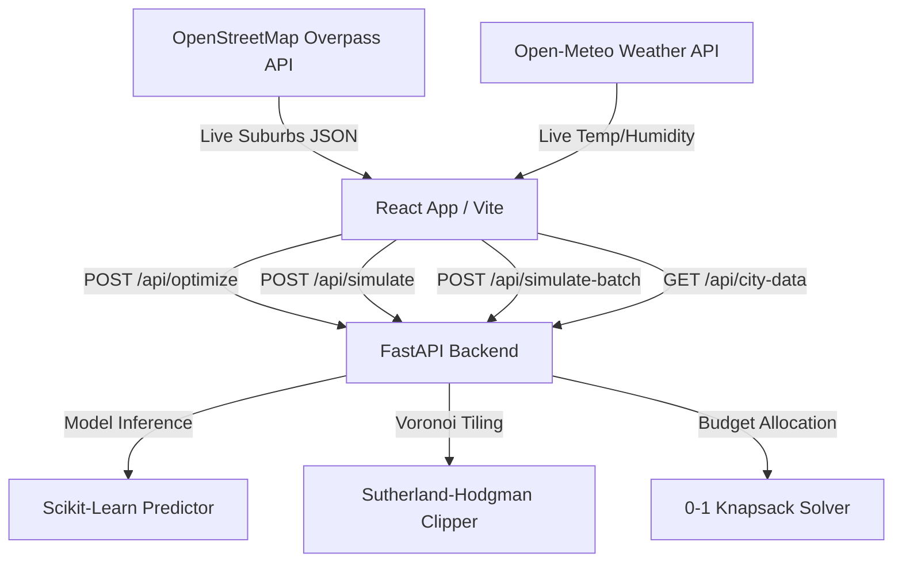

# HeatWise AI: Features List & Complete User Guide

Welcome to **HeatWise AI**, a premium, state-of-the-art urban cooling decision support console. This application integrates Machine Learning microclimate diagnostics, real-time geocoded weather analysis, and integer programming (0-1 Knapsack optimization) to help city planners and environmental engineers combat Urban Heat Islands (UHIs).

---

## 🌟 Core Application Features

### 1. Real-Time Geocoding & Weather Integration
* **Live GPS Locator**: Auto-detects user coordinates and uses reverse geocoding to resolve local city data.
* **OpenStreetMap (OSM) Suburb Queries**: Direct integration with the OpenStreetMap Overpass API. It queries coordinates or city searches and resolves the actual, active neighborhood boundaries (like *Gunadala*, *Patamata*, or *Labbipet*).
* **Live Weather Fetching**: Integrates Open-Meteo APIs to capture real-time ambient temperatures, wind speeds, and relative humidity.

### 2. Machine Learning Diagnostics
* **Expected Temperature Predictor**: A trained Scikit-Learn regression model evaluates the expected temperature of each neighborhood based on three core environmental indicators:
  1. **Vegetation Index (NDVI)**: Density of tree canopy and green cover.
  2. **Albedo**: Solar reflectance of roads, pavements, and roofs.
  3. **Building Density**: Volumetric concrete mass and urban sprawl.
* **Residual Heat Anomalies**: Subtracts the ML-expected baseline from the actual temperature to pinpoint heat islands. Areas with positive residuals ($>0.5^\circ\text{C}$) are flagged as priority zones.
* **Causal Diagnosis Engine**: Evaluates the metrics to determine the primary cause of UHI:
  * *Low Vegetation & Canopy Deficit*
  * *Low Solar Reflectance (Albedo Deficit)*
  * *Dense Concrete & Heat Trapping Structures*

### 3. Interactive Explorer Map (Page 1)
* **Gapless Organic Voronoi Boundaries**: Implements a Sutherland-Hodgman polygon clipper to divide cities into contiguous, gap-free organic neighborhoods, avoiding simple grids.
* **Dynamic Layer Overlays**: Planners can toggle the heat map overlay to view:
  * **Residual Heat**: Highlight priority anomaly zones.
  * **Observed Temp**: Direct heat levels.
  * **Vegetation (NDVI)**: Tree canopy coverage.
  * **Building Density**: Urban concrete mass.
* **Interactive Popups**: Hovering over or clicking any zone reveals detailed environmental stats, UHI causes, confidence levels, and active coordinates.

### 4. Microclimate Sandbox (Page 2)
* **What-If Planners**: Simulates physics-based interventions on a selected neighborhood:
  * *Tree Planting Count* (0 to 500 trees).
  * *Cool Roofs Percentage* (0% to 100% reflectance coating).
  * *Reflective Pavements* (high-albedo asphalt coatings).
* **Predictive Reductions**: Runs the ML model on the modified parameters to instantly calculate temperature drops and cost estimates.

### 5. Cooling Budget Optimizer (Page 3)
* **0-1 Knapsack Decision Solver**: Accepts a total city-wide cooling budget (in Crores). It runs a knapsack optimization algorithm on active map data to choose the combination of neighborhood projects that yields the maximum cumulative cooling ROI (measured in *Person-Degrees of Cooling*).
* **Automated Roadmap Layout**: Generates a card-based project roadmap detailing which neighborhoods to target, recommended interventions, projected temperature drops, costs, and project timelines.
* **Simulate Entire Plan**: Clicking this button computes the combined cooling effects of all recommended projects and projects them onto the Explorer map.

### 6. Cosmoq & Cyber Blueprint Aesthetics
* **Swaying Aurora Beams**: Beautiful vertical light pillars (cyan, orange, magenta) sway in the background to provide a cosmic, Framer-like aesthetic.
* **Holographic Blueprint Map**: Applies a custom color filter directly to Leaflet's base tiles, displaying a glowing cyan-teal holographic blueprint grid map.
* **Double-Theme Console**: A capsule sliding switch toggles between Dark Mode and a Slate-Gray Light Mode, swapping map themes and legend panels reactively.

---

## 📖 Step-by-Step User Guide

### Step 1: Select Your Location
1. Locate the **Quick Presets** dropdown in the top header. You can pick preset cities (e.g., *Vijayawada*, *Hyderabad*, or *Visakhapatnam*).
2. Alternatively, enter any city name or specific address in the **Search Location** bar. The geocoder will locate the coordinates and fetch active OSM neighborhoods.
3. You can also click the **Locate Me** button (location pin icon) to let the browser detect your GPS coordinates and fetch your local city map.

### Step 2: Diagnose Heat Islands (Explorer Page)
1. Ensure you are on the **🗺️ Explorer** page.
2. Select your desired overlay layer (e.g., **Residual Heat (USP)**) in the top-left map panel.
3. Locate neighborhoods colored in warm pink/magenta. These represent severe Urban Heat Islands.
4. Click on any highlighted neighborhood (e.g., *Labbipet*).
5. Review the **Zone Analysis** panel on the right. It displays:
   * Real-time observed temp vs. ML-expected temp.
   * The calculated Residual Heat level.
   * The primary UHI cause, confidence rating, and the AI-recommended cooling intervention.

### Step 3: Run What-If Simulations (Sandbox Page)
1. Select a neighborhood on the map and click the **🧪 Sandbox** tab (or slide to Page 2).
2. Use the sliders on the right panel to test interventions:
   * Drag the **Plant Urban Trees** slider (e.g., to 250 trees) to add vegetation.
   * Adjust the **Convert Cool Roofs** percentage slider to coat rooftops.
   * Toggle the **Reflective Pavements** switch.
3. Review the live metrics below the sliders:
   * **Projected Temp Drop**: The estimated decrease in temperature (e.g., $-1.4^\circ\text{C}$).
   * **Estimated Budget**: Projected capital cost for the modifications.
4. Click **Apply Simulation to Map** to project the microclimate cooling effect onto the Explorer map.

### Step 4: Optimize Cooling Budgets (Optimizer Page)
1. Navigate to the **💰 Optimizer** page.
2. Input your funding limit in the **Budget Allocation** field (e.g., `10` Crore).
3. Click the **Optimize** button.
4. Review the generated metrics:
   * **Allocated Funds**: The portion of the budget used.
   * **Cumulative Cooling**: The total temperature drops across all optimized neighborhoods.
   * **Budget spent progress bar**.
5. Examine the **Priority Cooling Roadmap** cards below. They list target neighborhoods, specific intervention types, costs, and completion timeframes.
6. Click **Simulate Entire Plan on Map** to view the combined thermal drop across all optimized neighborhoods on the Explorer map.

### Step 5: Toggle Visual Themes
1. Look at the top-right header panel for the sliding switch.
2. Slide it right (sun icon) to switch to **Bright Mode** (Light slate-gray layout and clean light-gray voyager map).
3. Slide it left (moon icon) to switch to **Dark Mode** (Cosmic space auroras and cybernetic cyan blueprint map).

---

## 🛠️ Technical Architecture

* **Frontend**: React (Vite), Leaflet (Maps rendering), Lucide Icons, Vanilla CSS (Variables, keyframe animations, filters).
* **Backend**: Python FastAPI, Scikit-Learn (UHI estimation models), NumPy (mathematical polygon calculations), Uvicorn.
